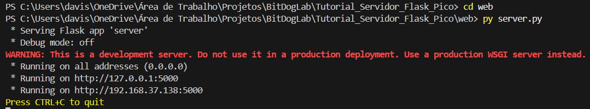

# Tutorial de Comunicação entre RP2040 e Servidor Flask com Socket.IO

## 1. Clonar o Repositório

Antes de tudo, é necessário clonar este repositório em sua máquina. Abra o terminal (CMD, PowerShell ou VSCode) e digite:

```bash
git clone https://github.com/davissontiago/BitDogLab.git
```

Depois, navegue até a pasta: `Servidor_Flask_Pico_Wifi`
e abra no VsCode.


---

## 2. Instalar o Python

Este projeto requer Python instalado na sua máquina. Caso ainda não tenha:

- Baixe o instalador do Python: https://www.python.org/downloads/
- Durante a instalação, marque a opção **"Add Python to PATH"**


---

## 3. Instalar Dependências

Abra o **CMD como administrador** (digite `cmd` no menu Iniciar, clique com o botão direito e selecione "Executar como administrador") e execute:

```bash
pip install flask
pip install flask-socketio
```

> Obs: o nome correto do pacote é `flask-socketio` com hífen.


---

## 4. Abrir o Terminal no VSCode

Para abrir o terminal integrado no VSCode:

- Pressione `Ctrl + '` (crase)


---

## 5. Executar o Servidor

Com o terminal aberto, entre na pasta `web`:

```bash
cd web
```

E execute o servidor Flask:

```bash
py server.py
```

Após iniciar, você verá uma saída semelhante a:



> Anote o segundo endereço (no exemplo acima, `192.168.37.138`). Esse é o IP que será usado pela placa RP2040 para se comunicar com o servidor e deve ser substituido no arquivo **`picow_http_client.c`**


###### O link para acessar o site é composto pelo ip e a porta 5000.
###### Exemplo: `http://192.168.37.138:5000`
---

## 6. Configurar o Wi-Fi no Projeto RP2040

O nome e senha da rede Wi-Fi estão configurados no arquivo `CMakeLists.txt` do projeto C para a RP2040. 

Abra esse arquivo e substitua:


Substitua pelos dados corretos da sua rede Wi-Fi (SSID e senha).

### Observação:
#### `O computador (local onde o servidor está sendo hospedado) precisa estar na mesma rede wi-fi configurada na RP2040 para ela conseguir se comunicar com o servidor.`
---

## 7. Compilar e Enviar Código para a RP2040

Use o VsCode para compilar e enviar o código para a placa RP2040 normalmente.


---

## 8. Como Funciona a Comunicação

- A RP2040 se conecta à rede Wi-Fi e, ao detectar o pressionamento de um botão físico, envia uma requisição HTTP para o servidor Flask.
- O servidor Flask possui uma rota específica (`/CLICK`) que é acionada pela placa.
- Quando essa rota é acessada, o servidor envia um evento WebSocket usando a biblioteca `flask-socketio`.
- O navegador que estiver com a página aberta receberá esse evento e executará a ação correspondente (como mudar a cor de um quadrado de vermelho para verde e mostrar "ON").

Esse fluxo permite que um botão físico da placa RP2040 controle elementos gráficos de uma interface web em tempo real.


---

Se tiver dúvidas ou quiser contribuir, fique à vontade para entrar em contato pelo email: `davissontiagolf@gmail.com` 

